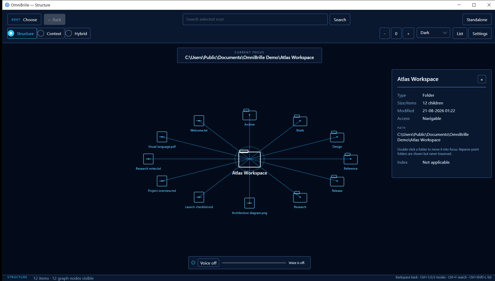
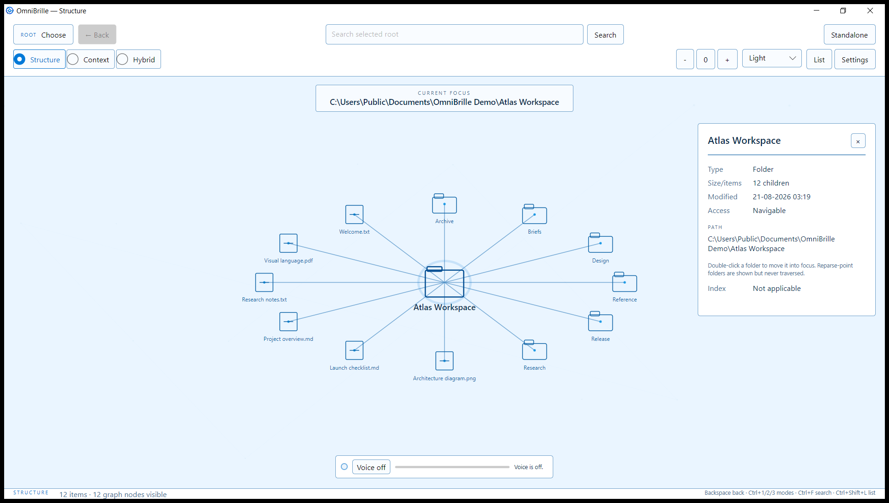
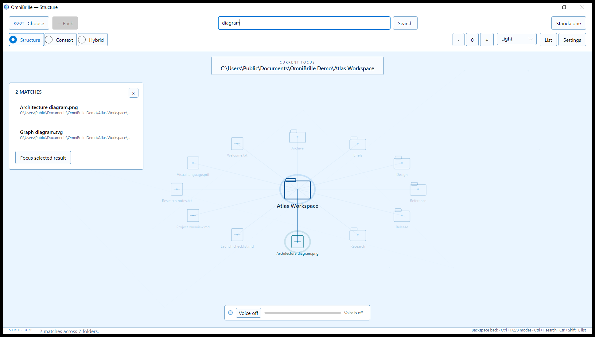
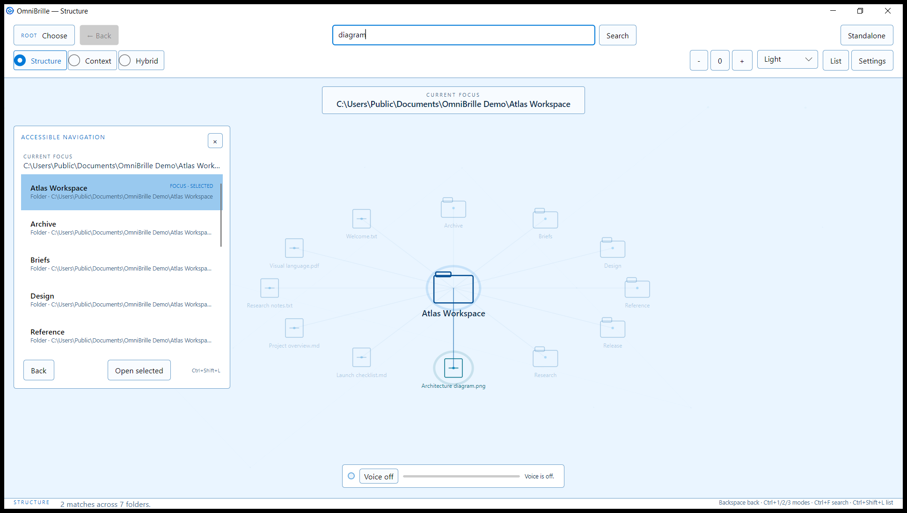

<p align="center">
  
</p>

# OmniBrille

Explore a folder as a spatial graph—locally, privately, and without indexing your whole computer.

OmniBrille is a Windows desktop file explorer that keeps the folder you are exploring at the center and arranges its immediate contents around it. Drill into folders, go back, search the selected tree, inspect details, and switch between a visual graph and a synchronized accessible list.

## Download

> **Release status:** v1.0.0 is not published yet. The DNG-free native renderer dependency has been produced and integrated, but the exact installer, visual, hosted lifecycle, and publication gates still must pass. Do not use or redistribute an older local preflight installer as the v1 release.

After qualification, the official [GitHub Releases page](https://github.com/nishdel/OmniBrille/releases) will be the download source. The prepared installer is self-contained, installs for the current user, and does not require a separate .NET installation or administrator access. It can be removed from Windows Installed apps.

> **Signing notice:** the authorized v1.0.0 installer will be unsigned. Windows may show **Unknown Publisher** or a SmartScreen reputation warning. Download only from the official GitHub Release after publication, compare its SHA-256 with the attached checksum, and follow your organization’s security policy. A checksum detects corruption; it does not authenticate an unsigned publisher.

Windows x64 is the only v1.0 download target. Interactive preflight qualification was performed on Windows 10 22H2 x64; other Windows client versions were not separately validated. Ubuntu is covered by source build/tests only; Linux desktop packaging and interactive use are not validated. macOS is not validated.

## See it in action



| Light theme | Search within the selected root |
|---|---|
|  |  |



All screenshots are from the installed v1.0 release candidate using a purpose-built, non-private demo folder.

## What it does

- Starts empty and reads only a folder you explicitly choose.
- Shows one focused folder and a bounded set of nearby items instead of crawling an entire drive.
- Streams large directories progressively and groups overflow into reversible pages.
- Supports drill-down, Back, selection, details, pan, zoom, and keyboard navigation.
- Searches names, folders, and paths inside the selected root with bounded foreground work.
- Provides Dark and Light themes, reduced motion, and reduced visual effects.
- Provides a synchronized accessible list with keyboard actions and graph automation peers.
- Stores only visual and optional voice configuration; selected roots and searches are not persisted.
- Has no telemetry, cloud upload, background indexer, service, auto-start entry, updater, or destructive file operation.

## Standalone first; OmniSorSe optional

OmniBrille works on its own for Structure navigation and structural Search. This is the supported v1.0 public experience.

A compatible [OmniSorSe](https://github.com/nishdel/OmniSorSe) build can explicitly launch OmniBrille with a short-lived, authorized Explorer Protocol session. In Connected mode, OmniSorSe remains the authority for roots, Search, metadata, and contextual relationships; OmniBrille presents those results as Structure, Context, or Hybrid without reading OmniSorSe’s database or inventing relationships.

Connected mode is compatibility-dependent and is not a promise of support for every Explorer Protocol v1 host. The exact combinations and limitations that have repository evidence are recorded in the [compatibility matrix](COMPATIBILITY.md). Direct launch never discovers or connects to OmniSorSe in the background.

## Privacy and trust

Standalone access is limited to the selected root. OmniBrille does not recursively follow directory reparse points, modify files, or persist the chosen root. Search is bounded and runs only when requested.

Optional local push-to-talk is disabled by default and requires a user-provided whisper.cpp runtime and model; neither is bundled or downloaded. Real microphone hardware behavior has not been validated for v1.0 and is outside the supported release contract. There is no wake word or always-listening mode.

The GitHub Release includes the release manifest, dependency graph, exact installer checksum, and generated artifact notes. The installed application contains the MIT project license and separately applicable third-party license/notice files. The repository records the [security and privacy posture](docs/SECURITY-PRIVACY.md). `Copy safe diagnostics` produces a user-reviewed support snapshot designed to exclude paths, filenames, queries, content, endpoints, grants, tokens, and session/node IDs.

## Current limitations

- The Windows installer is unsigned.
- The supported public contract is Windows x64 Standalone use; the interactive qualification host was Windows 10 22H2 x64.
- Connected mode requires a compatible OmniSorSe host and has narrower validation than Standalone.
- Automated accessibility coverage checks keyboard/list/automation behavior, but v1.0 is not claimed as screen-reader-certified or manually validated with every assistive technology.
- Performance budgets and diagnostics are backed by tests and representative engineering measurements, not a guarantee for every filesystem or machine.
- Voice is optional, Windows-only in implementation, and lacks real-microphone validation.
- There is no auto-update mechanism. The stable installer identity is designed for future in-place releases, but v1.0 does not claim a manually validated upgrade path.

After publication, the official GitHub Release will contain the exact artifact notes. See [compatibility](COMPATIBILITY.md) for the prepared release contract.

## Keyboard essentials

| Action | Shortcut |
|---|---|
| Search | `Ctrl+F` |
| Accessible list | `Ctrl+Shift+L` |
| Back | `Backspace` or `Alt+Left` |
| Select / activate | Arrow keys / `Enter` |
| Zoom / reset | `+`, `-`, `0` |
| Structure / Context / Hybrid | `Ctrl+1`, `Ctrl+2`, `Ctrl+3` |
| Cancel or dismiss | `Escape` |

Context and Hybrid explain when a compatible OmniSorSe connection is required; they do not fabricate standalone relationship data.

## Build from source

The SDK version is pinned in [`global.json`](global.json).

```powershell
dotnet restore .\OmniBrille.sln
dotnet build .\OmniBrille.sln --configuration Release --no-restore
dotnet test .\OmniBrille.sln --configuration Release --no-build --no-restore
dotnet run --project .\src\OmniBrille.Desktop\OmniBrille.Desktop.csproj
```

Build the Windows installer with:

```powershell
.\build\Package-Windows.ps1 -BootstrapInnoSetup
```

## License

OmniBrille project code is licensed under the **MIT License**. See [`LICENSE`](LICENSE). Bundled third-party components remain under their own terms, preserved in [`THIRD-PARTY-NOTICES.txt`](THIRD-PARTY-NOTICES.txt) and [`THIRD-PARTY-LICENSES`](THIRD-PARTY-LICENSES). The Windows renderer uses a project-built SkiaSharp 3.119.4 native asset with Adobe DNG/RAW support excluded; its [source pins, build procedure, and verification](docs/native-skia.md) are maintained in the repository.

## Engineering documentation

OmniBrille keeps current engineering knowledge in the repository:

- [Engineering start page](docs/engineering/README.md) — task-specific authority and validation router
- [Current architecture](docs/architecture.md) — subsystem ownership, state, data flow, and Mermaid diagrams
- [Windows packaging](docs/PACKAGING.md) — installer, signing, artifact, and lifecycle details
- [Compatibility matrix](COMPATIBILITY.md) — verified and unverified platform/OmniSorSe combinations
- [Security and privacy](docs/SECURITY-PRIVACY.md) — access, handoff, voice, diagnostics, and release boundaries
- [Explorer Protocol boundary](docs/explorer-protocol.md) — Connected-mode contract and evidence
- [Context rendering contract](docs/context-rendering-contract.md) — bounded relationship presentation
- [Release checklist](RELEASE_CHECKLIST.md) and [changelog](CHANGELOG.md)

The compact [`AGENTS.md`](AGENTS.md) routes Codex and specialist agents without duplicating architecture. Historical run reports are evidence, not current authority.
