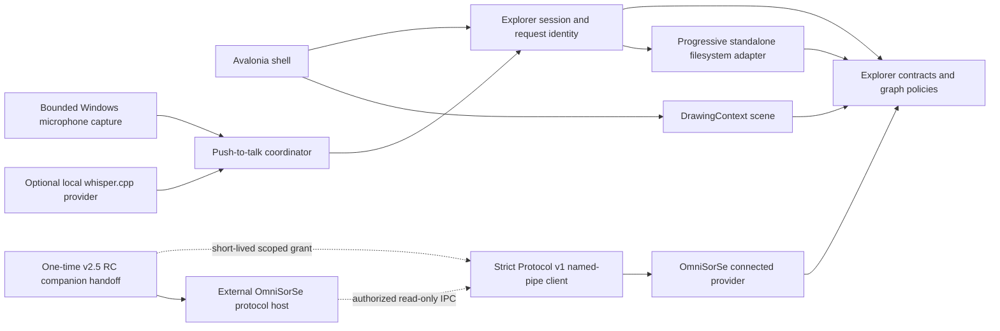

# Architecture

## Status and goals

This document describes the Stage 9 private-preview architecture: an independently packaged standalone Structure explorer and connected Structure/Context explorer, plus optional local push-to-talk input. Stage 9 retains the committed OmniSorSe v2.5 release-candidate handoff and unchanged Explorer Protocol v1; renderer, accessibility, packaging, diagnostics, signing, and voice surfaces remain independent of OmniSorSe internals.

OmniSorSe owns scanning, indexing, Search, Content Intelligence, Media Intelligence, OCR, transcripts, Related Files, organization, safe file operations, and persistent intelligence/index state. OmniBrille owns standalone spatial navigation, provider-independent Structure/Context presentation, and optional local speech transcription as an input method. Voice queries still use the current standalone/OmniSorSe Search provider. In short, OmniSorSe is the brain; OmniBrille is the visual lens and spatial navigation interface.

The dependency rule is inward: `Infrastructure` and `Desktop` depend on `Core`; `Core` depends only on the .NET base class library. The renderer never calls `System.IO`. The filesystem adapter never chooses positions, labels, colors, or animation. Search returns domain hits and is not owned by the canvas.

## Technology and rendering decision

Selected stack: .NET 8, C#, Avalonia 12.1, and an Avalonia custom `Control` using `DrawingContext`. Avalonia Headless supplies non-pixel shell tests. The transitive Avalonia build-telemetry service is excluded; OmniBrille has no runtime telemetry.

| Option | Strengths | Tradeoff | Decision |
|---|---|---|---|
| Avalonia custom drawing | Cross-platform path, GPU-backed composition, desktop input/text/accessibility framework, compact .NET integration | Scene/LOD work remains ours | Selected |
| WPF custom drawing | Mature Windows tooling and accessibility | Windows-only | Rejected for the initial architecture |
| WebView/WebGL | Strong graph and animation ecosystem | Browser/package cost and two-platform debugging | Deferred unless measured scene needs justify it |
| Direct Skia/Win2D | Maximum draw-loop control | More text, input, accessibility, and shell infrastructure to own | Deferred until profiling demonstrates need |

The renderer uses deterministic radial coordinates rather than continuous force physics. It draws a small number of inexpensive passes: atmospheric background, real edges/junctions, node glyphs, then accepted labels. Focus animation is a 440 ms deterministic cubic interpolation; reduced motion bypasses it. No animation encodes state.

## Components

### `OmniBrille.Core`

- `ExplorerEntry`, `ExplorerNode`, `ExplorerEdge`, `ExplorerRelationship`, and `ExplorerNeighborhood` are visual-agnostic contracts that distinguish Structure and Context without carrying wire DTOs.
- `IExplorerProvider` supplies a complete bounded snapshot; `IProgressiveExplorerProvider` optionally streams an empty shell, bounded child batches, and an explicit completion/failure marker.
- `IExplorerSearchProvider` performs explicit bounded search.
- `GraphNeighborhoodBuilder` enforces the scene budget, produces reversible aggregate pages, and can pin a selected search result.
- `RadialGraphLayout` assigns stable normalized positions across three depth rings and preserves coordinates for surviving node IDs.
- `GraphPresentationPolicy` owns deterministic LOD, label priority, search emphasis, and priority-based label collision rejection without Avalonia dependencies.
- `BoundedLruCache` supplies the small deterministic cache primitive used by renderer hot paths; cache capacity is always explicit.
- `ContextFilter` is an immutable local presentation predicate over fields Protocol v1 actually supplies: kind, ranking strength, and evidence class. It never requests, computes, or persists intelligence.
- `ContextNeighborhoodBuilder` retains the authoritative snapshot separately, applies reversible filters, and then applies `ContextRenderBudgetPolicy`: 48 combined nodes, 36 Context edges, 84 combined edges, and three Context edges per node. It filters malformed/missing endpoints but never infers a relationship.
- `ContextGraphLayout` keeps focus centered, places strongest relationships in deterministic inner/middle/outer rings, subtly recedes weaker nodes within a ring, preserves surviving angles, and has no continuous physics.
- `ContrastMath` makes documented theme text-pair checks reproducible without coupling Core to Avalonia colors.
- `NavigationState` owns history and enforces the selected-root boundary.
- `VisualPreferences` and `IVisualPreferencesStore` define the small persisted theme/effects/optional-voice-configuration contract.
- `IAudioCaptureService`, `ISpeechRecognitionProvider`, `VoiceInteractionCoordinator`, and `IVoiceActionTarget` define one bounded utterance flow without Avalonia, filesystem, protocol, or whisper.cpp dependencies. `VoiceCommandParser` applies an explicit English command table; every unknown utterance becomes Search.

These are application-local contracts, not the future wire protocol.

### `OmniBrille.Infrastructure`

`FileSystemExplorerProvider` performs filesystem work away from the UI thread. It emits batches of 32 by default, checks cancellation, caps a directory read at 5,000 observed entries, skips malformed entry metadata, turns common enumeration failures into domain failures/warnings, and refuses paths outside the selected root. Directory reparse points may be shown for orientation but are not navigable and are never recursively searched.

Structural search is breadth-first, starts only on user action, and is capped at 80 results and 500 visited directories by default. There is no recursive preload, background index, or duplicate intelligence system.

`JsonVisualPreferencesStore` keeps only safe UI preferences in the user's local application-data directory. Voice adds an opt-in flag, language, and explicit local runtime/model paths; it never persists audio, transcript, query, grant, or session identity. A pre-voice/malformed file safely uses disabled defaults; save uses a temporary file followed by replacement.

`WindowsWaveInAudioCaptureService` uses NAudio WinMM only while the user explicitly records. It normalizes the default device to bounded 16 kHz mono PCM held in memory and owns no service/background process. `WhisperCliSpeechRecognitionProvider` resolves only configured or bounded conventional local paths, validates availability lazily, creates one unpredictable temporary utterance workspace, invokes `whisper-cli` with `ProcessStartInfo.ArgumentList`, bounds time/output/JSON, and removes audio/output in `finally`. The standard package carries NAudio but no recognizer/model.

`OmniSorSeConnectedProvider` is the second acquisition adapter. It maps session-bound opaque protocol IDs to application-local navigation targets, pages structural children in batches, retains at most 512 children for deterministic aggregation, delegates Search to OmniSorSe, and maps only protocol-supplied details. For Context it makes one bounded `GetNeighborhood(IncludeContext: true)` request and, for an issued file focus, one bounded focus-local `GetRelated` request. Results share an eight-entry session-scoped LRU and one-request gate. Because v1 has no pushed disconnect event, a cached Context read performs a lightweight authenticated `GetProtocolInfo` probe before presenting cached data as live. The provider merges duplicate wire edges and supplies reason/evidence/provenance unchanged. It never calls `System.IO` to fill a connected-data gap.

`NamedPipeExplorerProtocolClient` implements the shipped v1 length-prefixed JSON framing over a current-user-only .NET named pipe. Every request opens one connection, carries the issued session ID/token and request ID, and has bounded connect/request timeouts. Strict JSON, string enums, response identity/version checks, collection/string/ID/relationship bounds, and stable error mapping reject malformed or incompatible responses before adaptation. `NamedPipeSessionGrantReceiver` consumes only the exact v2.5 one-time handoff name shape and a strict 4 KiB grant within 15 seconds. `OmniSorSeConnectionCoordinator` owns the state machine and keeps a short-lived grant only in memory for conservative retry.

### `OmniBrille.Desktop`

- `ExplorerSession` is the single authority for provider, Structure/Context mode, search, selection, details, provider-aware Back history, cancellation, and monotonically increasing request identities. Context replacement is committed only if its request generation is still current. A separate provider generation invalidates a deferred transcript whenever authority/opaque identities change.
- `MainWindow` is an Avalonia interaction adapter for folder access, provider/mode switching, authorized roots, search/result navigation, Context relation details, the synchronized accessible list, persisted effects/voice setup, diagnostics, keyboard shortcuts, and automation metadata. It implements the narrow voice action target by calling those existing operations; voice never owns a second navigation or Search state.
- `GraphSceneControl` owns only scene/input state: zoom, pan, hit targets, transition interpolation, hover, draw preparation, bounded drawing caches, per-phase local diagnostics, and the current visible-node automation projection.
- `DataRainControl` renders a fixed, deterministic number of sparse blue token streams, caches its small token set, becomes static/sparse for reduced motion, and stops when hidden.
- `ScenePalette` and application resources centralize the Dark/Light visual tokens.

## Progressive loading and stale-work safety

Opening a directory immediately applies a focus shell. Each provider batch rebuilds a bounded interactive neighborhood and reports an honest state: `Loading`, `PartiallyLoaded`, `Ready`, `Cancelled`, or `Failed`. Exact percentage is deliberately absent because filesystem enumeration does not know the final count in advance.

Every load and search receives a monotonically increasing request identity as well as a replaceable cancellation token. A result is applied only if its identity is still current. This identity check is required even when a filesystem/provider implementation cannot stop promptly after cancellation. Navigation history is committed only after the new location yields usable data; a failed drill-down restores the prior scene.

The same rule applies to protocol work. Cancelling a named-pipe read closes/cancels the client connection, which OmniSorSe v1 observes as provider cancellation; v1 has no separate cancel-operation message. A late response is still rejected by the session generation if cancellation loses a race. Protocol client diagnostics count rejected stale responses. Disconnect cancels/fails in-flight work and retains the last valid graph as visibly stale context; it cannot overwrite a newer standalone or reconnected scene.

## Explorer Protocol v1 integration boundary

`src/OmniSorSe.ExplorerProtocol` mirrors only the unchanged public dependency-free v1 DTO/enum contract. The companion workflow was inspected at OmniSorSe v2.5 RC commit `59be07c6cebff12072cbf18701fb16cb11801287`; OmniSorSe schema version 5 and protocol major 1 remain unchanged. OmniBrille does not reference `OpenSorSe.Application`, OmniSorSe binaries, SQLite, indexing, Search implementations, or storage.

Provider modes are separate authorities:

- standalone receives an explicitly selected path and applies native lexical root confinement;
- connected receives only an OmniSorSe-issued grant and authorized opaque roots; paths, when separately projected, are labels rather than access tokens;
- switching modes resets scene, selection, Back history, aggregate/search/details state, and provider-specific IDs while retaining safe visual preferences.

The connection state machine is `Standalone`, `Discovering`, `Connecting`, `Connected`, `Disconnected`, `Unavailable`, `Incompatible`, `Error`, and `Reconnecting`. The normal HUD uses plain-language status and exposes it as an accessible polite-live value. Developer diagnostics add transport/protocol, last request duration/count, Search count, timeout/reconnect count, and stale-response rejection count without logging secrets, queries, snippets, content, or normal-level full paths.

The v2.5 RC closes the Stage 4 launcher gap without a discovery listener. On explicit user action, OmniSorSe checks one configured path, one environment override, its adjacent directory, bounded conventional install locations, and `PATH`; it then launches a reviewed OmniBrille executable with only `--omnisorse-handoff <random-pipe-name>`. A current-user-only, one-connection pipe sends the strict grant. OmniBrille's first authenticated `GetProtocolInfo` request is the acknowledgement observed by OmniSorSe. Failure, timeout, early exit, or child-process exit revokes the scoped session. The bearer secret is never a CLI value, persisted setting, file, UI value, or normal diagnostic. Multiple launches intentionally create independent processes and grants; fragile single-instance forwarding is not introduced in Stage 5.

## Aggregation and graph bounds

The default scene budget remains 48 total nodes, including focus, receding context, and aggregate controls. The 5,000-entry enumeration cap and 48-node scene cap are separate defenses: the former protects I/O/memory and the latter protects layout, labels, hit testing, and frame cost.

Overview order is deterministic: folders before files, then case-insensitive name and path. Overflow becomes an interactive structural aggregate. Activating it opens an ordered bounded page; page scenes reserve space for overview, previous, and next controls. Back returns to the overview before leaving the folder. Refinement is structural paging only, not semantic clustering, and all page scenes obey the same hard budget. A source-truncated marker never implies that the provider knows an exact unseen total.

## Layout, focus, LOD, and labels

Focus is depth 0 at the center. Up to 12 high-detail children occupy depth 1, up to 18 more occupy depth 2, and remaining budgeted nodes occupy a lower-opacity depth 3. Previous focus is a subdued context node. Stable node IDs are the continuity key: surviving nodes take the nearest deterministic slot within their semantic depth band, while their prior coordinates remain the animation origin. This preserves angular orientation without allowing files or prior page members to displace structurally preferred folders. On focus navigation the selected child interpolates from its old position to center and the former focus interpolates into context.

LOD combines zoom, layout scale, density, depth, and importance:

- `Point`: a tiny hit-testable luminous point and no label.
- `Glyph`: the same node's outlined glyph, without a label.
- `Labeled`: glyph plus an eligible label.
- `Focused`: guaranteed label and strong selection/focus treatment.

Label priority is focus, selected, visible search match, hover, aggregate, immediate folder, immediate file, outer node, then context. Focus/selection/search/hover labels are required; other labels pass through a stable priority sort and bounding-box collision rejection. Zoom-aware budgets are 10 labels when distant, 22 at normal zoom (or all scenes of 24 or fewer), and up to 34 close. At 125%, 150%, and 200% text scale, the normal-density caps reduce deterministically to 18, 14, and 10. Required labels may overlap rather than disappear, preserving state over decoration.

During search, visible matches gain the search accent and unrelated nodes/edges recede. Focusing a result navigates to its folder and pins the match within the 48-node graph budget. The compact result surface remains secondary and dismissible.

Context uses the same scene object with an explicit mode and edge kind. The current node stays at the focal position; up to ten strongest related nodes occupy the inner Context ring, sixteen the middle ring, and the remaining accepted endpoints the subdued outer ring. Provider strength subtly adjusts radius, scale, and opacity within a ring so weak relationships recede without changing deterministic order. Stable opaque IDs provide deterministic angular jitter and surviving nodes retain their angle when their depth remains the same. Context edges are thinner cyan dashed strokes; structural edges remain solid blue, and decorative background lines remain faint and non-interactive. Selection strengthens one Context relationship without adding edge labels or rainbow categories.

The compact Context-filter HUD filters only the already-authorized immutable snapshot by relationship kind, minimum ranking strength, or evidence class. `ExplorerSession` owns that filter beside the authoritative snapshot and rebuilds locally, so reset is lossless and does not issue a protocol request. UI counts distinguish authorized, matching, and visible relationships; an empty filter result is different from an authoritative no-relationships result. Provider/root/session replacement clears the filter and snapshot together.

Switching Structure to Context stores the Structure return target and selection, then replaces the bounded scene after the authoritative request completes. Context refocus pushes only the prior Context focus; Back unwinds Context focuses and then returns to the saved Structure scene. Reduced motion bypasses long migration, while Reduced visual effects removes optional Context glow but preserves the dash/solid distinction. Search in Context still delegates to OmniSorSe; selecting a result requests its real Context rather than treating result co-occurrence as a relationship.

## Visual settings and diagnostics

`Reduced motion` disables focus interpolation and turns the loading treatment into a static sparse pattern. `Reduced visual effects` lowers glow passes, atmospheric density, decorative token density, and label collision padding while preserving the complete graph and controls. The settings are independent and persist locally.

The developer diagnostics overlay is disabled by default. It samples visible nodes, edges, accepted labels, scene budget, zoom/text scale, layout and scene-preparation duration, total render duration, background/edge/glyph/label phases, per-render managed allocations, bounded cache occupancy, data-rain duration/token count, and most recent load duration. Voice adds state plus initialization/capture/transcription/execution duration, transcript length, classification, and safe error category. This is local instrumentation, not telemetry. The separate user-invoked support report is built from fixed safe fields and cannot receive audio, transcript text, model/runtime path, filesystem path, filename, query, content, protocol endpoint, grant, token, or session/node ID. Unexpected provider/model/transport/failure values are reduced to bounded categories before the text reaches the clipboard.

Profiling isolated the Stage 2 search-highlight regression to repeated `FormattedText` construction/measurement plus repeated brush/pen creation. `GraphSceneControl` now holds a 256-entry LRU text-layout cache, a 192-entry brush cache, and a 384-entry pen cache. Text keys include content, culture, font size/weight, maximum width, and color; opacity is applied while drawing so animation/search dimming does not create new layouts. Theme and render-scale changes clear the caches, names are part of the key, zoom/LOD sizes are part of the key, and LRU capacity bounds stale variants. Folder/file glyphs remain inexpensive primitive geometry, so profiling did not justify a larger icon-geometry subsystem.

## Failure behavior

- Missing roots yield a focus snapshot and not-found state rather than crashing.
- Access-denied and recoverable enumeration failures yield partial content plus a warning when possible.
- Individual unreadable/malformed entries are skipped.
- Directory reparse points are not followed recursively.
- Cancellation stops obsolete filesystem/search work where possible; request identity prevents late data from being applied regardless.
- Navigation outside the selected root is rejected in both navigation state and filesystem adapter.
- The renderer receives only a `ExplorerNeighborhood` already constrained to its budget.
- Invalid/mismatched Protocol v1 versions, response IDs, enums, fields, IDs, payload shapes, and negotiated bounds fail closed while standalone remains usable.
- A disconnected connected graph remains visible but is not presented as live; retry requires an unexpired in-memory grant, and a restarted server requires a new grant because node IDs are session-bound.

## Accessibility foundations

Folder selection, Back, search, theme, graph canvas, settings toggles, Context filters, details, compact results, and the accessible list have meaningful automation names/help. The graph is focusable; arrows change selection, Enter activates, Backspace/Alt+Left navigate back, Escape dismisses or cancels, `Ctrl+F` focuses search, `Ctrl+Shift+F` opens Context filters, `Ctrl+Shift+L` opens the list, and `+`/`-`/`0` control zoom.

The microphone button exposes an accessible state-specific name/help, the listening/transcribing status and brief transcript are polite live regions, cancellation is keyboard reachable, and `Ctrl+Shift+Space` toggles the one-shot capture. Reduced motion replaces the listening pulse with a static high-contrast state; no waveform is required to understand recording state.

The graph automation peer exposes one `TreeItem` peer for each node in the current bounded scene—never the unrendered source set. Each peer supplies name/type, bounds, current-focus/selected/aggregate item status, help, keyboard focus, and an invoke action. Children are invalidated when the scene changes and selection status changes are raised locally. The accessible list consumes the same `ExplorerSession.Neighborhood` and `SelectedNode`; it has no provider or navigation state of its own. Graph/list selection, search match state, drill-down, aggregate actions, details, and Back therefore cannot diverge.

Headless UI tests exercise this shared state, node automation actions, keyboard graph navigation, themes, loading, search, reduced motion/effects, and simulated 100/125/150/200% text scale. Standard UI text pairs are checked against a 4.5:1 floor (primary text is substantially higher); decorative network lines are explicitly not treated as text. Practical screen-reader behavior remains platform/backend dependent and is not presented as certification.

Context graph peers announce a visible node as contextually related and provide one concise server-authored reason when present. The shared accessible list exposes the same Context nodes, selection, search state, refocus action, Back state, and concise reason; full evidence/provenance remains in the keyboard-reachable details surface. `Ctrl+1` and `Ctrl+2` select Structure and Context. The bounded automation tree never exposes omitted protocol nodes or invisible relationships.

Known accessibility gaps remain: direct edge selection is node-centric because Protocol v1 has no durable relationship ID; graph peers expose selected state through item status rather than a multi-select pattern; no formal assistive-technology certification has been performed; and macOS automation runtime behavior is untested.

Connected UI tests additionally verify accessible live connection status, opaque-ID navigation, shared graph/list selection, real-field Search/details, disconnect announcement, and clearing provider identity on standalone switch.

## Performance baseline and budget decision

Stage 3 retains 48 rather than raising the budget. Candidate 32/48/64 fixtures were all comfortable on the development machine, so readability—not raw draw throughput—is the deciding constraint: 48 preserves the readable 12/18/remaining depth split without increasing outer-ring/label pressure. The diagnostics overlay and representative fixtures establish local engineering baselines, not product guarantees.

The untouched Stage 2 search sample was 25.835 ms. With bounded text/resource caching, representative warmed samples place normal 48-node scenes around 1–3 ms and search emphasis around 6 ms in the Avalonia headless renderer. Reduced effects removes edge-glow passes and lowers decorative density; the paired search fixture measured a meaningful reduction. Isolated cold frames may exceed 16.7 ms while fonts are first shaped or a scene arrives; the target is representative interactive rendering below the 60 Hz frame budget, not a claim that every transition frame is universally below it.

A synthetic 48-node/72-context-edge fixture was rejected as too dense and produced a costly cold frame. Product Context permits at most 36 contextual edges, three per visible node, and 84 combined edge slots. Stage 5's fixture renders actual dashed Context edges and records Full/Reduced effects separately. The Context provider allows one uncached focus request at a time and retains only eight session-local snapshots, preventing request fan-out and durable ID retention. See [the Context rendering contract](context-rendering-contract.md) for semantics and update rules.

The Stage 6 installed-workflow fixture produced a real three-node/two-relationship Context scene using ordinary indexed controlled files and server-authored deterministic evidence. Installed standalone window readiness was 2,656 ms; the UI-observed initial Context switch was about 646 ms and a Context refocus about 418 ms, including protocol and UI scheduling. A local filter update took 2.230 ms. The warmed 48-node Structure fixture rendered in 1.190 ms; search highlight in 6.114 ms. The maximum accepted synthetic Context fixture (48 nodes, 47 structural plus 36 contextual edges) rendered in 4.019 ms full and 4.222 ms reduced in one sample; the reduced edge phase fell from 1.007 to 0.787 ms, while total-frame variance was dominated by labels. These are local engineering samples, not universal guarantees.

The Stage 7 regression sample, after the Avalonia 12.1.1 patch, measured installed standalone window readiness at 2,924 ms and normal OmniSorSe companion readiness at 2,155 ms on the same development host. Warm representative render samples were 1.000 ms small, 1.605 ms medium, 1.987 ms for a 180-item bounded source, 2.029 ms aggregate-heavy, and 5.780 ms search-highlight. The maximum accepted Context fixture measured 4.486 ms full and 4.740 ms reduced; the reduced edge phase fell from 1.218 to 0.960 ms. A separate deliberately cold search-effects pair measured 24.058 ms full and 6.977 ms reduced, confirming that reduced effects materially lowers the expensive first emphasis frame even though ordinary warmed samples remain the interactive baseline. Context filtering measured 1.409 ms. Run-to-run font shaping and host load make these regression samples, not guarantees.

The Stage 9 real-provider sample used the official whisper.cpp v1.9.1 x64 CLI and temporary `tiny.en` model with four non-private Windows TTS phrases. Capability validation took 139 ms. Utterances of 1.45–2.68 seconds transcribed in 1.33–1.49 seconds and classified correctly as Back, Context, Dark theme, and Search; the last preserved `Raspberry Pi files` as the Search argument. The host exposed no WinMM input device, so this validates the real recognizer/process/cleanup path but not live microphone capture. Temporary utterance workspaces were empty after every run and the downloaded validation runtime/model were removed. These are local samples, not guarantees; process-per-utterance model load remains the primary latency limitation.

No automatic hardware fingerprint or adaptive node-count system was introduced. The default remains deterministic. The two user-facing controls—Reduced motion and Reduced visual effects—are reliable, reversible degradation paths; a future sustained-frame guardrail may reduce decoration only after GPU-backed runtime evidence justifies it.

## Cross-platform posture

Avalonia platform detection, storage providers, rendering, input, and automation abstractions remain in Desktop. Core and Infrastructure use `Path`/`Environment.SpecialFolder` rather than Windows literals. Root-boundary comparison follows native semantics: case-insensitive on Windows and case-sensitive on Linux/macOS. Explorer/protocol IDs are opaque case-sensitive strings on every platform, preventing Linux `A`/`a` collisions and avoiding assumptions about future OmniSorSe IDs. Folder reparse/symbolic-link children remain non-navigable and are not recursively followed. Voice contracts, parser, coordinator, process provider, and tests remain portable; the initial live capture adapter deliberately reports unavailable outside Windows rather than pretending Linux/macOS microphone support.

GitHub Actions restores, verifies format, builds Release with analyzers-as-errors, runs all tests, and audits NuGet vulnerabilities on Windows and Ubuntu, including transport-independent fake-client and local named-pipe framing tests. The Windows leg also creates the unsigned installer, release manifest, dependency inventory, checksum, and checksum-bound tester notes using the pinned packaging script. A separate manual workflow executes the full clean-checkout private-preview gate and has explicit unsigned or fail-closed signed paths. Its dependent fresh Windows runner has no checkout and receives only the exact artifact for independent hash, per-user install, installed-window, registration, uninstall, and cleanup validation. Windows runtime is the primary interactive validation platform. Linux remains build/test validated, and no Linux connected runtime or macOS runtime claim is made.

## Windows packaging boundary

The primary Windows package is an Inno Setup 6.7.3 current-user installer. It publishes a self-contained, non-trimmed, multi-file `win-x64` application into `%LOCALAPPDATA%\Programs\OmniBrille`, an existing bounded v2.5 RC locator candidate. One stable installer application ID provides in-place upgrades and one uninstall entry. Visual/voice configuration remains outside the install directory; all audio/transcripts, grants, bearer secrets, session IDs, opaque node IDs, and Context caches remain transient. Publish and installer gates exclude PDB/source/test/database/key/audio/model material and developer paths. No speech model, whisper.cpp executable, OmniSorSe application binary, service, auto-start entry, file association, telemetry component, or updater is installed.

`Directory.Build.props` is the version/product source of truth. Packaging emits a SHA-256 sidecar, non-sensitive JSON release manifest, and sanitized runtime dependency inventory. Unsigned development packaging is normal. Signed mode accepts only a certificate thumbprint already imported into a Windows certificate store, signs the application and installer, validates both signatures, and fails closed when credentials or validation are unavailable. CI imports any PFX from encrypted secrets into its ephemeral current-user store and removes it after use. See [PACKAGING.md](PACKAGING.md), [the compatibility matrix](../COMPATIBILITY.md), and [the release checklist](../RELEASE_CHECKLIST.md).

## Stage 9 non-goals

No always-listening mode, wake word, cloud speech requirement, conversational/LLM assistant, destructive voice action, Hybrid mode, indexing/database implementation, cloud service, telemetry, updater, production signing certificate, public release, or OmniSorSe source change is implemented. Context is read-only, focus-local, and entirely server-authored. Incremental edge updates and durable edge selection are intentionally absent because Protocol v1 has no stable relationship ID. The repository still needs an explicit maintainer license decision before public distribution.
