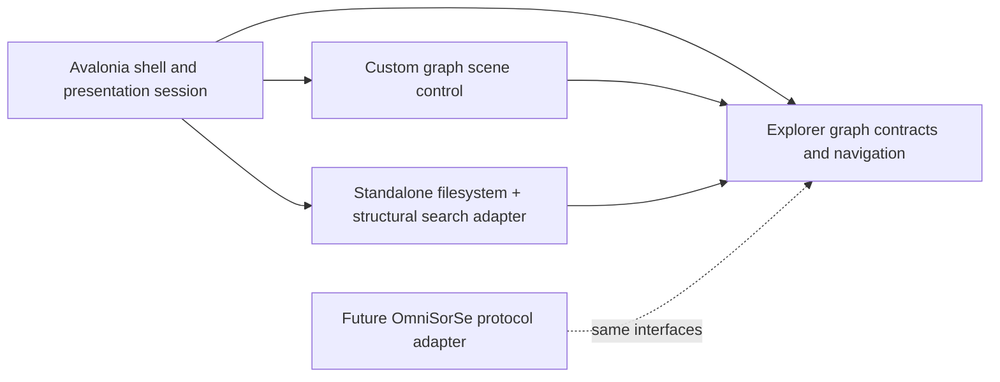

# Architecture

## Status and goals

This document describes the initial standalone Structure-mode vertical slice. The architecture keeps visual rendering independent from acquisition so a future OmniSorSe adapter can provide the same explorer graph without exposing database or indexing internals.

The dependency rule is inward: `Infrastructure` and `Desktop` depend on `Core`; `Core` depends only on the .NET base class library. The renderer never calls `System.IO`. The filesystem adapter never chooses screen positions or colors. Search returns explorer-domain hits and is not owned by the canvas.

## Technology and rendering decision

Selected stack: .NET 8, C#, Avalonia 12.1, and an Avalonia custom `Control` using its `DrawingContext`.

The transitive Avalonia build-telemetry service is explicitly excluded. OmniExplorer itself has no runtime telemetry, and normal repository builds do not emit Avalonia build telemetry.

| Option | Strengths | Initial tradeoff | Decision |
|---|---|---|---|
| Avalonia custom drawing | Cross-platform path, GPU-backed composition, desktop input/text/accessibility framework, compact .NET integration, mature packaging | Custom scene/L-O-D work remains ours | Selected |
| WPF + retained/custom drawing | Mature Windows tooling and accessibility | Windows-only; weaker strategic cross-platform path | Rejected for the initial architecture |
| WebView/WebGL renderer | Strong graph/WebGL ecosystem and animation tooling | Browser runtime/package cost, native integration complexity, two-platform debugging surface | Deferred; reconsider only if measured scene needs exceed Avalonia |
| Direct Skia/Win2D engine | Maximum draw-loop control | More text, input, accessibility, and application-shell infrastructure to own | Deferred until profiling demonstrates need |

Avalonia is not selected merely because the companion app uses it. Repository separation prevents any Avalonia or renderer dependency from entering OmniSorSe, while the custom scene gives OmniExplorer enough control for the reference direction. The initial renderer uses deterministic radial coordinates rather than continuous force physics, multi-pass low-cost line glow, simple outlined icons, label level-of-detail, and a hard scene budget. This protects spatial orientation and keeps frame cost predictable.

## Components

### `OmniExplorer.Core`

- `ExplorerEntry`, `ExplorerNode`, `ExplorerEdge`, and `ExplorerNeighborhood` are visual-agnostic structural contracts.
- `IExplorerProvider` acquires one bounded directory snapshot.
- `IExplorerSearchProvider` performs an explicit bounded search.
- `GraphNeighborhoodBuilder` orders children deterministically, enforces the node budget, creates aggregate nodes, and can pin a selected search hit into the visible budget.
- `RadialGraphLayout` produces normalized stable positions. It knows no drawing APIs.
- `NavigationState` owns history and enforces the explicitly selected root boundary.

These are application-local contracts, not the future wire protocol.

### `OmniExplorer.Infrastructure`

`FileSystemExplorerProvider` is the standalone adapter. It performs filesystem work away from the UI thread, observes cancellation between entries, caps a single-directory read at 5,000 metadata-bearing entries, does not traverse reparse-point directories, and turns common enumeration errors into warnings/failure states. Search is breadth-first, begins only on user action, and is capped at 80 results and 500 visited directories by default.

The provider intentionally does not recursively materialize a drive or maintain a duplicate index.

### `OmniExplorer.Desktop`

- `ExplorerSession` coordinates provider requests, cancellation, navigation, search, scene construction, selection, and presentation status.
- `MainWindow` is a thin Avalonia interaction adapter: folder picker, buttons, result/list accessibility surface, themes, and details.
- `GraphSceneControl` draws the scene and owns only render/input state (zoom, pan, hit targets, transition interpolation).
- `ScenePalette` and application resources centralize shared Dark/Light visual tokens.

The loading overlay is intentionally representative rather than a particle subsystem. It establishes the data-rain direction while keeping work focused on useful graph interaction.

## Graph model and bounds

A request represents one focused folder and immediate children, plus at most one receding context node. The first-pass default scene budget is 48 nodes. Folders precede files and both groups have stable ordinal-ignore-case ordering. When content exceeds the remaining budget, one non-navigable aggregate summarizes hidden content. An explicit search result may displace the last ordinary visible child so the destination remains graph-visible.

The filesystem enumeration cap and the scene budget are separate defenses: the first protects I/O/memory; the second protects layout, text, hit testing, and frame time. A source-truncated aggregate uses a `+` suffix so the UI does not pretend to know an unenumerated exact total.

Future depth/neighborhood providers may return multi-level edges, but they must still declare and enforce budgets before reaching the renderer.

## Failure and cancellation behavior

- Missing roots return a focus snapshot with a not-found state rather than crashing.
- Access-denied and recoverable enumeration failures return partial content plus a warning when possible.
- Individual malformed/unreadable entries are skipped.
- Directory reparse points are visible but not navigable or searched recursively.
- Loading and search have replaceable cancellation token sources; starting a newer operation cancels the older one.
- Navigation outside the selected root is rejected in both the state layer and filesystem adapter.

Animations do not encode state: the focus/path HUD, selection outline, details surface, and result list remain authoritative. A future reduced-motion switch can make `SetScene(..., animate: false)` a user preference without changing navigation.

## Performance evolution

The architecture can evolve toward roughly 100–300 meaningful nodes, but the first-pass default is deliberately 48 after visual testing showed that higher counts harmed orientation before renderer profiling. Before raising it or changing engines, profile render time, text cost, allocations, label density, and weak-GPU behavior. Likely incremental steps are cached glyph/icon geometry, viewport culling, cached background layers, additional label tiers, transition suppression during resize, and reduced-effects tokens. A Skia-backed scene or WebGL host is a measured fallback, not an architectural rewrite, because acquisition/layout contracts do not depend on Avalonia.

## Accessibility foundations

All essential actions have conventional controls. The graph is focusable and supports arrow selection, Enter activation, Backspace navigation, visible selection/focus, and zoom controls. Search has a textual result alternative. Theme resources preserve a shared high-contrast blue language and text can use platform scaling. Later work must add per-node automation peers, a full list/tree alternative, reduced motion/effects settings, and formal contrast/keyboard testing.

## Non-goals in this pass

No OmniSorSe IPC, Context mode, semantic relationships, voice, OCR/transcription, content/media intelligence, indexing database, cloud service, telemetry, or destructive file operation is implemented.
