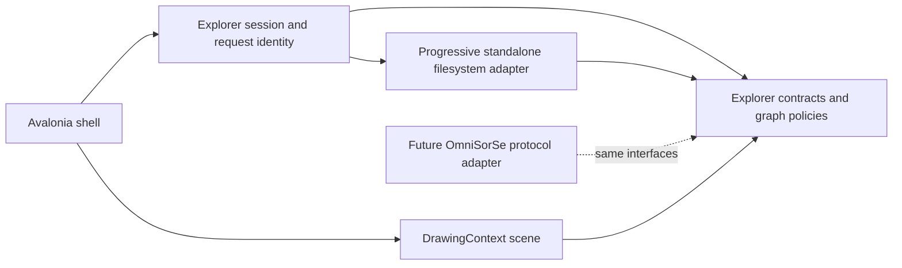

# Architecture

## Status and goals

This document describes the Stage 2 standalone Structure explorer. The architecture keeps visual rendering independent from acquisition so a future OmniSorSe adapter can provide the same explorer graph without exposing database or indexing internals.

OmniSorSe owns scanning, indexing, Search, Content Intelligence, Media Intelligence, OCR, transcripts, Related Files, organization, safe file operations, and persistent intelligence/index state. OmniBrille owns standalone spatial navigation, Structure presentation, and future OmniSorSe-backed Context and voice experiences. In short, OmniSorSe is the brain; OmniBrille is the visual lens and spatial navigation interface.

The dependency rule is inward: `Infrastructure` and `Desktop` depend on `Core`; `Core` depends only on the .NET base class library. The renderer never calls `System.IO`. The filesystem adapter never chooses positions, labels, colors, or animation. Search returns domain hits and is not owned by the canvas.

## Technology and rendering decision

Selected stack: .NET 8, C#, Avalonia 12.1, and an Avalonia custom `Control` using `DrawingContext`. Avalonia Headless supplies non-pixel shell tests. The transitive Avalonia build-telemetry service is excluded; OmniBrille has no runtime telemetry.

| Option | Strengths | Tradeoff | Decision |
|---|---|---|---|
| Avalonia custom drawing | Cross-platform path, GPU-backed composition, desktop input/text/accessibility framework, compact .NET integration | Scene/LOD work remains ours | Selected |
| WPF custom drawing | Mature Windows tooling and accessibility | Windows-only | Rejected for the initial architecture |
| WebView/WebGL | Strong graph and animation ecosystem | Browser/package cost and two-platform debugging | Deferred unless measured scene needs justify it |
| Direct Skia/Win2D | Maximum draw-loop control | More text, input, accessibility, and shell infrastructure to own | Deferred until profiling demonstrates need |

The renderer uses deterministic radial coordinates rather than continuous force physics. It draws a small number of inexpensive passes: atmospheric background, real edges/junctions, node glyphs, then accepted labels. Focus animation is a 440 ms deterministic cubic interpolation; reduced motion bypasses it. No animation encodes state.

## Components

### `OmniBrille.Core`

- `ExplorerEntry`, `ExplorerNode`, `ExplorerEdge`, and `ExplorerNeighborhood` are visual-agnostic structural contracts.
- `IExplorerProvider` supplies a complete bounded snapshot; `IProgressiveExplorerProvider` optionally streams an empty shell, bounded child batches, and an explicit completion/failure marker.
- `IExplorerSearchProvider` performs explicit bounded search.
- `GraphNeighborhoodBuilder` enforces the scene budget, produces reversible aggregate pages, and can pin a selected search result.
- `RadialGraphLayout` assigns stable normalized positions across three depth rings and preserves coordinates for surviving node IDs.
- `GraphPresentationPolicy` owns deterministic LOD, label priority, search emphasis, and priority-based label collision rejection without Avalonia dependencies.
- `NavigationState` owns history and enforces the selected-root boundary.
- `VisualPreferences` and `IVisualPreferencesStore` define the small persisted theme/effects contract.

These are application-local contracts, not the future wire protocol.

### `OmniBrille.Infrastructure`

`FileSystemExplorerProvider` performs filesystem work away from the UI thread. It emits batches of 32 by default, checks cancellation, caps a directory read at 5,000 observed entries, skips malformed entry metadata, turns common enumeration failures into domain failures/warnings, and refuses paths outside the selected root. Directory reparse points may be shown for orientation but are not navigable and are never recursively searched.

Structural search is breadth-first, starts only on user action, and is capped at 80 results and 500 visited directories by default. There is no recursive preload, background index, or duplicate intelligence system.

`JsonVisualPreferencesStore` keeps only visual preferences in the user's local application-data directory. A malformed file safely falls back to defaults; save uses a temporary file followed by replacement.

### `OmniBrille.Desktop`

- `ExplorerSession` coordinates provider/search requests, progressive states, cancellation, monotonically increasing request identities, navigation commit/rollback, aggregation, selection, and status.
- `MainWindow` is an Avalonia interaction adapter for folder access, search/result navigation, HUD controls, details, persisted effects, diagnostics, keyboard shortcuts, and automation metadata.
- `GraphSceneControl` owns only scene/input state: zoom, pan, hit targets, transition interpolation, hover, draw preparation, and local diagnostics.
- `DataRainControl` renders a fixed, deterministic number of sparse blue token streams and stops when hidden.
- `ScenePalette` and application resources centralize the Dark/Light visual tokens.

## Progressive loading and stale-work safety

Opening a directory immediately applies a focus shell. Each provider batch rebuilds a bounded interactive neighborhood and reports an honest state: `Loading`, `PartiallyLoaded`, `Ready`, `Cancelled`, or `Failed`. Exact percentage is deliberately absent because filesystem enumeration does not know the final count in advance.

Every load and search receives a monotonically increasing request identity as well as a replaceable cancellation token. A result is applied only if its identity is still current. This identity check is required even when a filesystem/provider implementation cannot stop promptly after cancellation. Navigation history is committed only after the new location yields usable data; a failed drill-down restores the prior scene.

## Aggregation and graph bounds

The default scene budget remains 48 total nodes, including focus, receding context, and aggregate controls. The 5,000-entry enumeration cap and 48-node scene cap are separate defenses: the former protects I/O/memory and the latter protects layout, labels, hit testing, and frame cost.

Overview order is deterministic: folders before files, then case-insensitive name and path. Overflow becomes an interactive structural aggregate. Activating it opens an ordered bounded page; page scenes reserve space for overview, previous, and next controls. Back returns to the overview before leaving the folder. Refinement is structural paging only, not semantic clustering, and all page scenes obey the same hard budget. A source-truncated marker never implies that the provider knows an exact unseen total.

## Layout, focus, LOD, and labels

Focus is depth 0 at the center. Up to 12 high-detail children occupy depth 1, up to 18 more occupy depth 2, and remaining budgeted nodes occupy a lower-opacity depth 3. Previous focus is a subdued context node. Stable node IDs are the continuity key: surviving nodes take the nearest deterministic slot within their semantic depth band, while their prior coordinates remain the animation origin. This preserves angular orientation without allowing files or prior page members to displace structurally preferred folders. On focus navigation the selected child interpolates from its old position to center and the former focus interpolates into context.

LOD combines zoom, layout scale, density, depth, and importance:

- `Point`: a tiny hit-testable luminous point and no label.
- `Glyph`: the same node's outlined glyph, without a label.
- `Labeled`: glyph plus an eligible label.
- `Focused`: guaranteed label and strong selection/focus treatment.

Label priority is focus, selected, visible search match, hover, aggregate, immediate folder, immediate file, outer node, then context. Focus/selection/search/hover labels are required; other labels pass through a stable priority sort and bounding-box collision rejection. Zoom-aware budgets are 10 labels when distant, 22 at normal zoom (or all scenes of 24 or fewer), and up to 34 close. Required labels may overlap rather than disappear, preserving state over decoration.

During search, visible matches gain the search accent and unrelated nodes/edges recede. Focusing a result navigates to its folder and pins the match within the 48-node graph budget. The compact result surface remains secondary and dismissible.

## Visual settings and diagnostics

`Reduced motion` disables focus interpolation and turns the loading treatment into a static sparse pattern. `Reduced visual effects` lowers glow passes, atmospheric density, decorative token density, and label collision padding while preserving the complete graph and controls. The settings are independent and persist locally.

The developer diagnostics overlay is disabled by default. It samples visible nodes, edges, accepted labels, scene budget, zoom, layout duration, scene-preparation duration, last render duration, and most recent load duration. This is local instrumentation, not telemetry. It intentionally avoids recording or exporting filesystem content.

## Failure behavior

- Missing roots yield a focus snapshot and not-found state rather than crashing.
- Access-denied and recoverable enumeration failures yield partial content plus a warning when possible.
- Individual unreadable/malformed entries are skipped.
- Directory reparse points are not followed recursively.
- Cancellation stops obsolete filesystem/search work where possible; request identity prevents late data from being applied regardless.
- Navigation outside the selected root is rejected in both navigation state and filesystem adapter.
- The renderer receives only a `ExplorerNeighborhood` already constrained to its budget.

## Accessibility foundations

Folder selection, Back, search, theme, graph canvas, settings toggles, details, and compact results have meaningful automation names/help. The graph is focusable; arrows change selection, Enter activates, Backspace/Alt+Left navigate back, Escape dismisses or cancels, `Ctrl+F` focuses search, and `+`/`-`/`0` control zoom. Search supplies a textual result alternative. Details and settings are dismissible and keyboard reachable. Avalonia headless tests cover window creation, automation names, themes, persisted reduced settings, loading/details state, and search-result dismissal.

Known accessibility gaps remain: the custom canvas exposes selected-node help text but not one automation peer per graph node; a complete list/tree navigation alternative and formal screen-reader/contrast validation remain future work.

## Performance baseline and budget decision

Stage 2 retains 48 rather than raising the budget. It gives a readable 12/18/remaining depth split and keeps label collision work small. The diagnostics overlay and representative fixture profiling establish local baselines; results are development-machine observations, not guarantees. Exact measurements from the final validation run are recorded in the task report.

Before increasing the scene budget, profile text shaping, label collision, frame/render time, allocations, and weaker GPUs. Likely measured evolutions are cached text/icon geometry, viewport culling, cached background layers, and dynamic effects tiers. A different rendering host remains a fallback, not an architectural rewrite, because provider/session/layout contracts do not depend on Avalonia.

## Stage 2 non-goals

No OmniSorSe IPC, protocol transport, Context mode, semantic relationships, Related Files, voice, OCR/transcription, content/media intelligence, indexing database, cloud service, telemetry, destructive file operation, installer, or updater is implemented.
