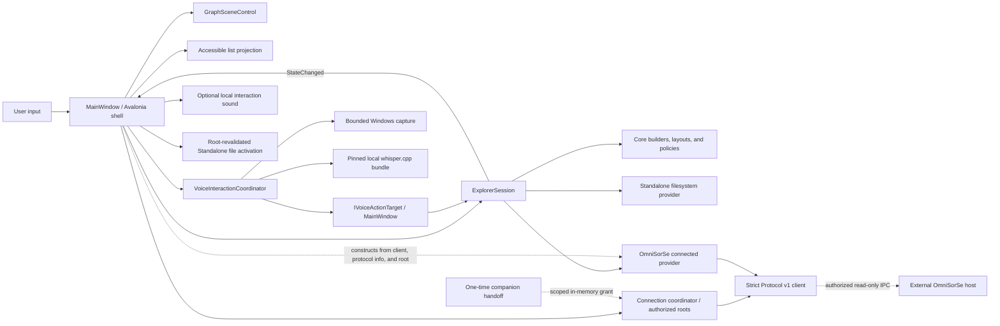
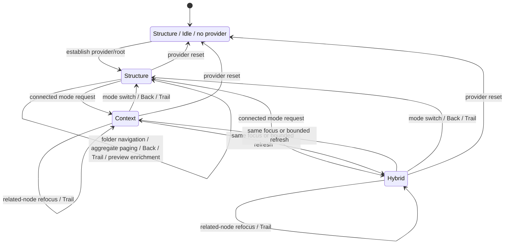

# Architecture

> **Authority:** current OmniBrille subsystem, ownership, state, and flow model. Stage-specific timings and installed-workflow narratives are explicitly historical evidence, not active architecture or universal guarantees.

## Status and goals

This document describes the current source architecture: an independently packaged Standalone Structure explorer and compatibility-dependent Connected Structure/Context/Hybrid explorer, plus optional click-to-toggle local Voice. The published v1.1 support contract remains Windows x64 Standalone. Unreleased source changes add actionable Trail destinations, bounded descendant previews, revised pointer/layout/label behavior, and quiet-completion for Voice. They retain Explorer Protocol v1, server-authored Context, the pinned installer-owned voice bundle, and existing persistence boundaries; they do not constitute qualification of a new release artifact.

OmniSorSe owns scanning, indexing, Search, Content Intelligence, Media Intelligence, OCR, transcripts, Related Files, organization, safe file operations, and persistent intelligence/index state. OmniBrille owns standalone spatial navigation, provider-independent Structure/Context/Hybrid presentation, and optional local speech transcription as an input method. Hybrid composes existing authorized snapshots; it does not create intelligence. Voice queries still use the current standalone/OmniSorSe Search provider.

Knowledge status in this document:

- **CURRENT TRUTH** — local project dependencies, owners, state, flows, limits, and invariants below describe current source and its regression contracts. Executed validation and release qualification belong in the relevant run report.
- **STRONGLY SUPPORTED EXTERNAL** — OmniSorSe host ownership and compatibility are supported by the mirrored contract and pinned cross-repository validation evidence. The available later checkout retains the wire DTOs and handoff shape but has evolved relationship projection; a changed external host still needs real integration validation.
- **HISTORICAL** — named Stage timings, installed-workflow observations, and rejected pressure samples explain decisions but are not current guarantees.
- **UNKNOWN / NOT VERIFIED** — real microphone hardware, physical audio output, formal screen-reader behavior, borderless-chrome DPI/snap, GPU-backed continuous-motion quality/performance, Linux interactive/connected runtime, and macOS runtime remain unverified.
- **SUPERSEDED** — earlier design-only protocol descriptions and byte-for-byte additive JSON tolerance do not describe the current strict client. Git history and [`history-and-lessons.md`](engineering/history-and-lessons.md) preserve that context.



The dependency rule is inward: `Infrastructure` and `Desktop` depend on `Core`; `Core` depends only on the .NET base class library. The renderer never calls `System.IO`. The filesystem adapter never chooses positions, labels, colors, or animation. Search returns domain hits and is not owned by the canvas.

## Technology and rendering decision

Selected stack: .NET 8, C#, Avalonia 12.1, and an Avalonia custom `Control` using `DrawingContext`. Avalonia Headless normally supplies non-pixel shell tests; opt-in Skia-backed fixtures can also save software-rendered composition evidence. Neither path certifies the native GPU or accessibility backend. The transitive Avalonia build-telemetry service is excluded; OmniBrille has no runtime telemetry.

| Option | Strengths | Tradeoff | Decision |
|---|---|---|---|
| Avalonia custom drawing | Cross-platform path, GPU-backed composition, desktop input/text/accessibility framework, compact .NET integration | Scene/LOD work remains ours | Selected |
| WPF custom drawing | Mature Windows tooling and accessibility | Windows-only | Rejected for the initial architecture |
| WebView/WebGL | Strong graph and animation ecosystem | Browser/package cost and two-platform debugging | Deferred unless measured scene needs justify it |
| Direct Skia/Win2D | Maximum draw-loop control | More text, input, accessibility, and shell infrastructure to own | Deferred until profiling demonstrates need |

The renderer uses deterministic radial base coordinates rather than continuous force physics. It draws a small number of inexpensive passes: atmospheric background, real edges/junctions, node glyphs, then accepted labels. Focus animation is a 440 ms deterministic cubic interpolation; low-amplitude idle float and hover lens are analytic functions of immutable base state. One approximately 24-fps foreground ticker serves both and stops when hidden, minimized, reduced, or detached. Reduced motion returns the exact base layout. No animation encodes unique state.

## Components

### `OmniBrille.Core`

- `ExplorerEntry`, `ExplorerNode`, `ExplorerEdge`, `ExplorerRelationship`, and `ExplorerNeighborhood` are visual-agnostic contracts that distinguish Structure and Context without carrying wire DTOs. `ExplorerNodeRole` marks structural, contextual, combined, or descendant-preview participation; `ExplorerSceneSemantics` separately defines current-focus/direct-child/descendant-preview/previous-focus/contextual/both/aggregate meaning. `ExplorerDirectoryPreview` associates actual provider-supplied children with an explicit parent ID inside a directory snapshot.
- `HybridNeighborhoodBuilder` composes one authorized Context snapshot into a deduplicated bounded scene. It preserves structural parent/orientation first, reserves capacity for strongest Context, enforces the shared edge policy, and applies Context filters only to the contextual layer.
- `HybridGraphLayout` is a deterministic focus-centered layout: structural orientation occupies a left/top plane, Context occupies a right plane, and combined-role nodes use one compromise position. It has no force simulation.
- `IExplorerProvider` supplies a complete bounded snapshot; `IProgressiveExplorerProvider` optionally streams an empty shell, bounded child batches, and an explicit completion/failure marker.
- `IExplorerDirectoryPreviewProvider` optionally supplies one bounded sample of actual child folders. Acquisition limits and filesystem/protocol validation remain inside each provider; the renderer and list never acquire previews.
- `IExplorerSearchProvider` performs explicit bounded search.
- `GraphNeighborhoodBuilder` enforces the scene budget, produces reversible aggregate pages, can pin a selected search result, and admits descendant previews only behind explicit already-admitted direct-folder parents and only into unused slots.
- `RadialGraphLayout` assigns direct children semantic depth 1 and descendant previews depth 2 around their known parents, independently of `PresentationBand`. Deterministic angular/radial variation and filename-extension grouping affect only presentation; surviving node IDs retain orientation within their assigned band/group.
- `GraphMotionPolicy` evaluates deterministic bounded visual float/lens coordinates with no accumulated state or topology change.
- `GraphPresentationPolicy` owns deterministic glyph/label treatment, Search emphasis, and bounded label placement without Avalonia dependencies. Admitted nodes retain recognizable glyphs and names rather than losing a subset of labels at different zoom levels.
- `GraphEdgeGeometry` supplies glyph-periphery endpoints and segment/box intersection for graph connectors and label leaders, without renderer dependencies.
- `BoundedLruCache` supplies the small deterministic cache primitive used by renderer hot paths; cache capacity is always explicit.
- `ContextFilter` is an immutable local presentation predicate over fields Protocol v1 actually supplies: kind, ranking strength, and evidence class. It never requests, computes, or persists intelligence.
- `ContextNeighborhoodBuilder` is stateless: it applies reversible filters and `ContextRenderBudgetPolicy` to a snapshot retained by `ExplorerSession`. The [Context rendering contract](context-rendering-contract.md) owns the current numeric limits. The builder filters malformed/missing endpoints but never infers a relationship.
- `ContextGraphLayout` keeps focus centered, places strongest relationships in deterministic inner/middle/outer rings, subtly recedes weaker nodes within a ring, preserves surviving angles, and has no continuous physics.
- `ContrastMath` supports effective-contrast tests that parse the actual Avalonia theme resources.
- `NavigationState` owns history, enforces Standalone root boundaries, and compares Connected opaque IDs ordinally.
- `VisualPreferences` and `IVisualPreferencesStore` define the small persisted theme/effects/Sound/Voice-language contract.
- `IFileActivationService` and `IInteractionSoundService` keep optional OS activation/playback outside session authority.
- `IAudioCaptureService`, `ISpeechRecognitionProvider`, `VoiceInteractionCoordinator`, and `IVoiceActionTarget` define one bounded utterance flow without Avalonia, filesystem, protocol, or whisper.cpp dependencies. `VoiceCommandParser` applies an explicit English command table; every unknown utterance becomes Search.

These are application-local contracts, not the future wire protocol.

### `OmniBrille.Infrastructure`

`FileSystemExplorerProvider` performs filesystem work away from the UI thread. The session requests 128-entry progressive batches; it projects every batch through the first 512 entries, then coalesces later projection to every fourth batch plus the final state so a 5,000-entry folder does not repeatedly sort the full cumulative set. The provider checks cancellation, retains at most 5,000 valid entries, caps additionally inspected entries and Search pending work, skips malformed metadata, turns common enumeration failures into domain failures/warnings, supplies an in-root parent target, and refuses paths outside the selected root. Directory reparse points may be shown for orientation but are not navigable and are never recursively searched.

Its separate preview operation inspects at most 64 immediate filesystem entries, including unreadable entries in that count, and returns at most three ordinary navigable subfolders. It checks the requested directory and its ancestors through the selected root for reparse points before enumeration, supplies native parent targets, and returns a bounded failure snapshot when the preview is unavailable. The normal progressive batch size is not used as an inspection-work guarantee.

Structural Search is breadth-first, starts only on user action, and is capped at 80 results, 500 visited directories, a bounded pending queue, and at most 50,000 inspected entries. There is no recursive preload, background index, or duplicate intelligence system.

`JsonVisualPreferencesStore` keeps only safe UI preferences in the user's local application-data directory: theme, reduced settings, diagnostics, Sound, Voice enablement, and language. It never persists runtime/model paths, audio, transcript, query, root, grant, or session identity. Loading a legacy file removes the retired Voice path fields without retaining their values; a pre-voice/malformed file safely uses normalized defaults. Save uses a temporary file followed by replacement.

`WindowsWaveInAudioCaptureService` uses NAudio WinMM only while the user explicitly records. It normalizes the default device to bounded 16 kHz mono PCM held in memory and owns no service/background process. `WhisperCliSpeechRecognitionProvider` resolves only the fixed installed `Voice` bundle in production, rechecks every compiled hash on resolution, creates one unpredictable local non-reparse temporary utterance workspace, invokes `whisper-cli` with `ProcessStartInfo.ArgumentList`, at most four workers, and a minimal environment without inherited temp authority, and bounds time/output/JSON. Cancellation/timeout kills the process tree and awaits exit; capture/transcript buffers are zeroed, deletion retries with bounded backoff, and failures are surfaced. Provider construction schedules one background cleanup of at most sixteen stale, application-shaped workspaces; readiness/transcription await it and oversized artifacts are rejected before zeroing. Test constructors retain replaceable paths/providers without exposing ordinary-user overrides.

`ShellFileActivationService` is Standalone-only at the UI boundary. It revalidates the selected-root path, file existence, the file and ancestor reparse state, and a denylist of executable/script/installer/control-panel/management-console/shortcut/application-reference/URL-like types immediately before `UseShellExecute=true`, then immediately releases the returned process handle. `CyberInteractionSoundService` synthesizes short nonsemantic cues in memory, debounces hover, bounds one active buffer, releases the output device promptly, and treats mute/device failure as no-op feedback.

`OmniSorSeConnectedProvider` is the second acquisition adapter. It maps session-bound opaque protocol IDs to application-local navigation targets, pages structural children in batches, retains at most 512 children for deterministic aggregation, delegates Search to OmniSorSe, and maps only protocol-supplied details. For Context it makes one bounded `GetNeighborhood(IncludeContext: true)` request and, for an issued file focus, one bounded focus-local `GetRelated` request. Results share an eight-entry session-scoped LRU and one-request gate. Because v1 has no pushed disconnect event, a cached Context read performs a lightweight authenticated `GetProtocolInfo` probe before presenting cached data as live. The provider merges duplicate wire edges and supplies reason/evidence/provenance unchanged. It never calls `System.IO` to fill a connected-data gap.

Connected previews use the issued opaque folder target for focus details and one child page of at most 32 requested nodes, retaining at most three folders and discarding the continuation. Focus identity, requested page size, and each child's parent ID are validated before mapping. Display paths remain text only. The operation uses existing Protocol v1 requests; it adds no wire capability, relationship inference, filesystem fallback, or durable identity storage.

`NamedPipeExplorerProtocolClient` implements the shipped v1 length-prefixed JSON framing over a current-user-only .NET named pipe. Every request opens one connection, carries the issued session ID/token and request ID, and has bounded connect/request timeouts. Strict JSON, string enums, response identity/version checks, collection/string/ID/relationship bounds, and stable error mapping reject malformed or incompatible responses before adaptation. `NamedPipeSessionGrantReceiver` consumes only the exact v2.5 one-time handoff name shape and a strict 4 KiB grant within 15 seconds. `OmniSorSeConnectionCoordinator` owns the state machine and keeps a short-lived grant only in memory for conservative retry.

### `OmniBrille.Desktop`

- `ExplorerSession` is the single authority for provider, Structure/Context/Hybrid mode, Search, selection, Details, provider-aware Back/Up/Root/trail state, cancellation, and monotonically increasing request identities. Connected Up consumes only server-authored opaque parent IDs. Context/Hybrid replacement is committed only if its request generation is current. A separate provider generation invalidates a deferred transcript whenever authority changes.
- `MainWindow` is an Avalonia interaction adapter for provider/mode/root/history operations, Search/result navigation, Context relation Details, safe file activation, sensory preferences, synchronized list, diagnostics, custom chrome, keyboard shortcuts, live status, and automation metadata. It implements the narrow voice action target by calling those existing operations; Voice never owns a second navigation or Search state.
- `GraphSceneControl` owns only scene/input state: zoom, pan, target-aligned hit rectangles, transition/analytic motion, hover, geometric keyboard navigation, draw preparation, bounded caches/diagnostics, and the current visible-node selection/invoke automation projection.
- `DataRainControl` renders a fixed, deterministic number of sparse blue token streams, caches its small token set, becomes static/sparse for reduced motion, and stops when hidden.
- `ScenePalette` and application resources centralize the Dark/Light visual tokens.

## State ownership

| State | Authoritative owner | Lifetime / boundary |
| --- | --- | --- |
| Provider, mode, visible neighborhood, Structure/Context/Hybrid snapshots, descendant previews, selection, Search, details, filters, connected `(mode, focus)` history, private Trail bindings, Structure return target/selection/aggregate page, and operation/provider generations | [`ExplorerSession`](../src/OmniBrille.Desktop/Presentation/ExplorerSession.cs) | In-memory application session; cleared or invalidated on provider replacement as appropriate |
| Active provider-specific access root/current target and structural-target Back history | [`NavigationState`](../src/OmniBrille.Core/NavigationState.cs) | In-memory; native filesystem paths in Standalone and ordinal opaque targets in Connected. |
| Handoff grant, protocol client/info, authorized roots, retry state | [`OmniSorSeConnectionCoordinator`](../src/OmniBrille.Infrastructure/OmniSorSe/OmniSorSeConnectionCoordinator.cs) | Short-lived, in-memory connected session |
| Issued connected nodes/display labels and Context LRU/gate | [`OmniSorSeConnectedProvider`](../src/OmniBrille.Infrastructure/OmniSorSe/OmniSorSeConnectedProvider.cs) | Per authorized root/provider; discarded with provider/grant replacement |
| Zoom, pan, hover/lens, hit targets, transition/float, drawing caches, render diagnostics | [`GraphSceneControl`](../src/OmniBrille.Desktop/Rendering/GraphSceneControl.cs) | UI-thread presentation state; never acquisition authority |
| Panel/chrome visibility, UI projection, details reveal, current preferences, sound/file/voice dispatch | [`MainWindow`](../src/OmniBrille.Desktop/MainWindow.axaml.cs) | UI-only state around the one session |
| Theme/effects/diagnostics, Sound, Voice enablement/language | [`JsonVisualPreferencesStore`](../src/OmniBrille.Infrastructure/JsonVisualPreferencesStore.cs) | Only durable application state; no roots, queries, graph, audio, transcript, grants, paths, or opaque IDs |



Structure history and connected `(mode, focus)` history are separate. Switching away from Structure records its return target, selection, and aggregate page; connected Back unwinds refocus/mode entries before restoring Structure. Trail projects at most six recent actionable destinations using provider-authored names and view modes. Its targets and history bindings stay private to the session. A direct jump acquires only the chosen destination and removes crossed history after success; failure retains the prior scene, mode, and history. Old Trail actions are rejected after navigation/provider changes, and no Trail action is available during primary loading. Provider replacement clears both history authorities rather than translating IDs.

## Progressive loading and stale-work safety

Standalone directory loading immediately emits a focus shell before content. The connected provider first awaits focus details and its first bounded child page, then yields progressive batches; it does not currently expose an earlier empty shell. Each applied provider batch rebuilds a bounded interactive neighborhood and reports an honest state: `Loading`, `PartiallyLoaded`, `Ready`, `Cancelled`, or `Failed`. Exact percentage is deliberately absent because enumeration/paging may not know a complete count in advance.

Every load and search receives a monotonically increasing request identity as well as a replaceable cancellation token. A result is applied only if its identity is still current. This identity check is required even when a filesystem/provider implementation cannot stop promptly after cancellation. Navigation history is committed only after the new location yields usable data; a failed drill-down restores the prior scene.

Trail jumps and restoration from Context/Hybrid to Structure await a complete bounded directory snapshot before committing mode/history changes. Other primary directory loads retain progressive projection. After a successful Structure overview is already visible as `Ready`, the session may request previews sequentially for at most four admitted navigable direct folders. It uses only currently free scene slots and never recursively previews the returned descendants. Provider, load generation, primary snapshot, neighborhood, mode, and aggregate state must still match before enrichment is applied. Cancellation, failed previews, or a stale result leaves the accepted primary scene intact.

The same rule applies to protocol work. Cancelling a named-pipe read closes/cancels the client connection, which OmniSorSe v1 observes as provider cancellation; v1 has no separate cancel-operation message. A late response is still rejected by the session generation if cancellation loses a race. Protocol client diagnostics count rejected stale responses. Disconnect cancels/fails in-flight work and retains the last valid graph as visibly stale context; it cannot overwrite a newer standalone or reconnected scene.

```mermaid
sequenceDiagram
    actor User
    participant UI as MainWindow
    participant Session as ExplorerSession
    participant Provider as Active provider
    participant Client as Protocol client
    participant Host as OmniSorSe host
    User->>UI: Navigate, Search, or refocus
    UI->>Session: Start operation
    Session->>Session: Increment operation generation; cancel prior same-kind work
    Session->>Provider: Bounded request + cancellation
    opt Connected
        Provider->>Client: Validated protocol request
        Client->>Host: Length-prefixed JSON over named pipe
        Host-->>Client: Bounded response or stable error
        Client-->>Provider: Strictly validated DTOs
    end
    Provider-->>Session: Application-local snapshot/result
    alt Generation is still current
        Session->>Session: Commit snapshot/history/state
        Session-->>UI: StateChanged
        opt Successful Structure overview with free scene slots
            Session->>Provider: Sequential bounded previews for at most four admitted folders
            Provider-->>Session: Up to three actual subfolders per parent
            Session->>Session: Recheck provider, generation, snapshot, scene, mode, and page
            Session-->>UI: Enrich current scene, or discard stale/failed previews
        end
    else Obsolete completion
        Session->>Session: Reject and count stale response
    end
```

## Explorer Protocol v1 integration boundary

`src/OmniSorSe.ExplorerProtocol` mirrors only the public dependency-free v1 DTO/enum contract. At the pinned OmniSorSe v2.5 RC evidence (`59be07c6cebff12072cbf18701fb16cb11801287`), the host schema was version 5 and protocol major was 1. The available later host checkout has schema 6 and evolved relationship projection while retaining the inspected wire/handoff shape. OmniBrille does not consume either schema and does not reference `OpenSorSe.Application`, OmniSorSe binaries, SQLite, indexing, Search implementations, or storage.

Provider modes are separate authorities:

- standalone receives an explicitly selected path and applies native lexical root confinement;
- connected receives only an OmniSorSe-issued grant and authorized opaque roots; paths, when separately projected, are labels rather than access tokens;
- switching modes resets scene, selection, Back history, aggregate/search/details state, and provider-specific IDs while retaining safe visual preferences.

The connection state machine is `Standalone`, `Discovering`, `Connecting`, `Connected`, `Disconnected`, `Unavailable`, `Incompatible`, `Error`, and `Reconnecting`. The normal HUD uses plain-language status and exposes it as an accessible polite-live value. Developer diagnostics add transport/protocol, last request duration/count, Search count, timeout/reconnect count, and stale-response rejection count without logging secrets, queries, snippets, content, or normal-level full paths.

The v2.5 RC closes the Stage 4 launcher gap without a discovery listener. On explicit user action, OmniSorSe checks one configured path, one environment override, its adjacent directory, bounded conventional install locations, and `PATH`; it then launches a reviewed OmniBrille executable with only `--omnisorse-handoff <random-pipe-name>`. A current-user-only, one-connection pipe sends the strict grant. OmniBrille's first authenticated `GetProtocolInfo` request is the acknowledgement observed by OmniSorSe. Failure, timeout, early exit, or child-process exit revokes the scoped session. The bearer secret is never a CLI value, persisted setting, file, UI value, or normal diagnostic. Multiple launches intentionally create independent processes and grants; fragile single-instance forwarding is not introduced in Stage 5.

## Aggregation and graph bounds

The default scene budget remains 48 total nodes, including focus, receding context, aggregate controls, and descendant previews. The 5,000-entry enumeration cap and 48-node scene cap are separate defenses: the former protects I/O/memory and the latter protects layout, labels, hit testing, and frame cost.

Overview order is deterministic: folders before files, then case-insensitive name and path. Overflow becomes an interactive structural aggregate. Activating it opens an ordered bounded page; page scenes reserve space for overview, previous, and next controls. Back returns to the overview before leaving the folder. Refinement is structural paging only, not semantic clustering, and all page scenes obey the same hard budget. A source-truncated marker never implies that the provider knows an exact unseen total.

Preview enrichment consumes only capacity left after primary child/aggregate admission. It neither evicts direct children nor changes their total or hidden counts. Each preview must be an actual navigable non-reparse folder with an explicit parent target matching an admitted direct folder; duplicate identities and absent or mismatched parents are rejected. It is a sample, so an absent preview never proves that a folder has no subfolders. [ADR 0003](decisions/0003-bounded-descendant-previews.md) records the provider-work and containment decision.

## Layout, focus, LOD, and labels

Focus is semantic depth 0 at the center. Every admitted direct child is semantic depth 1 and is explicitly described as a direct child of the current focus in the graph, synchronized list, details, and automation. Density is a separate `PresentationBand`: twelve children use the inner band, sixteen the middle band, and the bounded remainder the outer band. All remain recognizable outlined folder/file glyphs with a minimum 44-DIP effective target; density never creates a fake deeper hierarchy or point-star representation. Actual descendant previews use semantic depth 2, a smaller subdued folder glyph, a `↳` label prefix, and a structural edge to their admitted parent. Previous focus is a distinct history/orientation node, not a parent.

Structure positions vary deterministically in angle and distance. Known filename extensions group case-insensitively by exact extension, while unknown or missing extensions share a fallback group. This changes spatial proximity only, not acquisition order, counts, containment, or Context meaning. Stable node IDs are the continuity key: surviving nodes receive nearby deterministic slots within their assigned presentation band and type group while their prior coordinates remain the transition origin. Preview placement searches bounded free positions around the real parent and avoids direct-node targets where space permits; hit testing prioritizes direct nodes if targets overlap. On focus navigation the selected child interpolates from its old position to center and the former focus recedes into history context.

Zoom, layout scale, density, presentation band, and interaction importance adjust glyph emphasis without changing semantic relation. Although the shared LOD enum retains `Point` and `Glyph`, the current production policy floors every admitted node at `Labeled`; focus and interaction emphasis use `Focused`. The renderer retains a name for every admitted node whose center lies inside the graph control. It uses measured single-line text, with ellipsis for long names, and places focus first followed by stable node-ID order. A bounded nearest-free-position search moves labels around glyphs and earlier labels. Displaced labels may receive a leader from their glyph periphery; leaders crossing a glyph are suppressed. Zoom and text scale no longer hide an arbitrary label subset. If the viewport cannot hold all measured labels, names remain present and may overlap; the synchronized list remains the full-size reading surface.

The shell reserves graph-coordinate and label-placement space below the top navigation/focus HUD and above the bottom controls (`ScenePadding`), while atmosphere continues across the full client. Structural edges and their junctions stop outside each rendered glyph's envelope, and preview edges retain a visible branch treatment. These geometry rules also apply during scaled motion; they do not add topology or filesystem authority.

During search, visible matches gain the search accent and unrelated nodes/edges recede. Focusing a result navigates to its folder and pins the match within the 48-node graph budget. The compact result surface remains secondary and dismissible.

Context uses the same scene object with an explicit mode and edge kind. The current node stays at the focal position; up to ten strongest related nodes occupy the inner Context ring, sixteen the middle ring, and the remaining accepted endpoints the subdued outer ring. Provider strength subtly adjusts radius, scale, and opacity within a ring so weak relationships recede without changing deterministic order. Stable opaque IDs provide deterministic angular jitter and surviving nodes retain their angle when their depth remains the same. Context edges are thinner cyan dashed strokes; structural edges remain solid blue, and decorative background lines remain faint and non-interactive. Selecting a node strengthens every already-admitted contextual edge incident to it; the details surface separately derives the strongest admitted focus-to-selected-node relationship. There is no independent relationship selection and selection does not change edge admission.

The compact Context-filter HUD filters only the already-authorized immutable snapshot by relationship kind, minimum ranking strength, or evidence class. `ExplorerSession` owns that filter beside the authoritative snapshot and rebuilds locally, so reset is lossless and does not issue a protocol request. UI counts distinguish authorized, matching, and visible relationships; an empty filter result is different from an authoritative no-relationships result. Provider/root/session replacement clears the filter and snapshot together.

Switching Structure to Context or Hybrid stores the Structure return target and selection, then replaces the bounded scene after the authoritative request completes. Connected refocus and mode changes push one entry containing the prior mode and focus; Back unwinds those entries and then returns to the saved Structure scene. Reduced motion bypasses long migration, while Reduced visual effects removes optional Context glow but preserves the dash/solid distinction. Search in Context/Hybrid still delegates to OmniSorSe; selecting a result requests its real provider-authored snapshot rather than treating result co-occurrence as a relationship.

Hybrid composes the acquired `ExplorerContextSnapshot` with the most recent bounded Structure snapshot for the same session. A same-focus Context-to-Hybrid switch rebuilds locally when that retained Structure snapshot already contains the focus. If an external related-node refocus is outside it, the session performs one bounded parent/directory read and merges only that authoritative parent, siblings, and containment edges; it never crawls or fans out requests. This is one replaceable snapshot rather than a new durable cache. The builder deduplicates opaque node IDs, assigns structural/contextual/both roles, and first retains the focus plus structural parent and immediate orientation. It reserves a bounded share for strongest matching Context endpoints, then fills unused capacity with Structure. Filtering removes only Context edges/endpoints; structural orientation never disappears because of a Context filter. The [Context rendering contract](context-rendering-contract.md) is authoritative for the current combined limits.

The Hybrid layout keeps focus at the same center. Structural parents sit above it, structural nodes occupy a stable left plane, contextual-only nodes occupy a strength-attenuated right plane, and combined-role nodes appear once near the shared inner plane with a small secondary junction marker. Solid blue containment, dashed cyan Context, focus/selection halos, search color, and extremely faint non-interactive background geometry remain separate channels. Context↔Hybrid mode switches preserve the focus and animate surviving coordinates; Reduced motion applies the new layout immediately.

## Visual settings and diagnostics

`Reduced motion` disables focus interpolation, idle float, hover-lens displacement, and visual details typing; the semantic Details content is always assigned atomically. It also turns the loading treatment into a static sparse pattern. `Reduced visual effects` lowers glow passes, atmospheric density, decorative token density, and label collision padding while preserving the complete graph and controls. `Sound` is an independent persisted master switch; muted operation performs no playback work and every action retains its visual/automation result. The settings are independent and persist locally.

The developer diagnostics overlay is disabled by default. It samples visible nodes, edges, accepted labels, scene budget, zoom/text scale, layout and scene-preparation duration, total render duration, background/edge/glyph/label phases, per-render managed allocations, bounded cache occupancy, data-rain duration/token count, and most recent load duration. Voice adds state plus initialization/capture/transcription/execution duration, transcript length, classification, and safe error category. This is local instrumentation, not telemetry. The separate user-invoked support report is built from fixed safe fields and cannot receive audio, transcript text, model/runtime path, filesystem path, filename, query, content, protocol endpoint, grant, token, or session/node ID. Unexpected provider/model/transport/failure values are reduced to bounded categories before the text reaches the clipboard.

Profiling isolated the Stage 2 search-highlight regression to repeated `FormattedText` construction/measurement plus repeated brush/pen creation. The all-name renderer exposed an additional cost from repeated draw-time text shaping; the current 256-entry LRU stores reusable Avalonia `TextLayout` objects, alongside a 192-entry brush cache and a 384-entry pen cache. Text keys include content, culture, font size/weight, maximum width, and color. Typography derives from immutable layout scale and zoom/text scale, rounded to half-point font sizes rather than following frame-by-frame hover/float displacement; drawing opacity does not create new layouts. Theme and render-scale changes clear the caches, names are part of the key, and LRU capacity bounds stale variants. Folder glyphs reuse one small vector outline; file glyphs remain inexpensive primitives.

## Failure behavior

- Missing roots yield a focus snapshot and not-found state rather than crashing.
- Access-denied and recoverable enumeration failures yield partial content plus a warning when possible.
- Individual unreadable/malformed entries are skipped.
- Directory reparse points are not followed recursively.
- Cancellation stops obsolete filesystem/search work where possible; request identity prevents late data from being applied regardless.
- Navigation outside the selected root is rejected in both navigation state and filesystem adapter.
- The renderer receives only a `ExplorerNeighborhood` already constrained to its budget.
- Invalid/mismatched Protocol v1 versions, response IDs, enums, fields, IDs, payload shapes, and negotiated bounds fail closed while standalone remains usable.
- A disconnected connected graph remains visible but is not presented as live; retry requires an unexpired in-memory grant, and a restarted server requires a new grant because node IDs are session-bound.

## Accessibility foundations

Folder selection, Back, Up, Root, navigation trail, Search, theme, graph canvas, settings toggles, Context filters, Details, results, Sound, Voice, and the accessible list have meaningful automation names/help and 44-DIP primary targets. Back is chronological history; Up uses the current provider-authored parent target; Root returns to the active authority root. Connected Up never derives an ID from a display path. The graph is focusable and shows a keyboard-focus cue distinct from graph focus/selection; arrows select the closest visible node in the requested geometric direction, Enter activates, Backspace/Alt+Left navigate back, Alt+Up navigates to the parent, Alt+Home returns to root, Escape dismisses or cancels, `Ctrl+F` focuses Search, `Ctrl+Shift+F` opens Context filters, `Ctrl+Shift+L` opens the list, `Ctrl+I` reopens Details, and `+`/`-`/`0` control zoom.

The microphone button exposes an accessible state-specific name/help, cancellation is keyboard reachable, and `Ctrl+Shift+Space` toggles capture. One independent polite status authority changes its automation name with each accepted current message; visible status text is not a duplicate live region. First activation enables Voice and starts listening; the second stops and transcribes locally. Two seconds of quiet after detected input also completes the utterance, while initial silence alone does not submit one. Initialization/transcription can be cancelled through the same control. Reduced motion replaces the listening pulse with a static high-contrast state; the input-level meter and text state are redundant cues.

The graph automation peer exposes one `TreeItem` peer for each node in the current bounded scene—never the unrendered source set—and the tree supplies optional single-selection semantics. Each peer supplies name/type, a target-aligned bound, explicit scene relation, current-focus/selected/aggregate/Search status, help, keyboard focus, `SelectionItem`, and invoke. A newly acquired/navigated scene starts without selection, so centered graph focus never opens Details. Children are invalidated when the scene changes; selection and full item-status property changes are raised locally when selection or Search emphasis changes. The accessible list consumes the same `ExplorerSession.Neighborhood` and `SelectedNode`; it has no provider or navigation state of its own. Graph/list selection, semantic relation, Search match, drill-down, aggregate actions, Details, Back, Up, and Root therefore cannot diverge.

Headless UI tests exercise this shared state, selection patterns and property transitions, node automation actions, geometric keyboard graph navigation, 44-DIP targets, themes, loading, Search, runtime reduced-motion changes, Sound, file activation, and simulated 100/125/150/200% text scale. Contrast tests parse the actual theme resources and renderer palette, alpha-composite HUD/loading/interactive-glyph surfaces, and enforce 4.5:1 text plus 3:1 non-text/focus-cue floors. Decorative network lines are explicitly not treated as text. Practical screen-reader behavior remains platform/backend dependent and is not presented as certification.

Context and Hybrid graph peers announce whether a visible node is structural, contextually related, or both and provide one concise server-authored reason when present. The shared accessible list exposes each deduplicated node once with the same role, selection, search state, refocus action, Back state, and concise reason; full evidence/provenance remains in the keyboard-reachable details surface. `Ctrl+1`, `Ctrl+2`, and `Ctrl+3` select Structure, Context, and Hybrid. The bounded automation tree never exposes omitted protocol nodes or invisible relationships.

Known accessibility gaps remain: direct edge selection is node-centric because Protocol v1 has no durable relationship ID; no formal assistive-technology certification or retained real Narrator/NVDA run has been performed; OS-level 125/150/200% scale and high-contrast behavior still require exact installed interactive inspection; and macOS automation runtime behavior is untested.

Connected UI tests additionally verify accessible live connection status, opaque-ID navigation, shared graph/list selection, real-field Search/details, disconnect announcement, and clearing provider identity on standalone switch.

## Performance evidence and current budget decision

The current decision is a deterministic 48-node scene, the Context/Hybrid limits in the [Context rendering contract](context-rendering-contract.md), bounded renderer caches, local diagnostics, and user-controlled reduced motion/effects. Candidate 32/48/64 Structure fixtures showed that readability and label pressure—not primitive draw throughput—justify 48. A denser 72-Context-edge candidate was rejected. There is no automatic hardware fingerprint or adaptive node count.

Stage 2 Search emphasis exposed repeated text-layout/brush/pen allocation; bounded caches and representative pressure fixtures corrected it. Later warmed headless samples were comfortably below the 16.7 ms target, but cold font shaping, host load, and headless/GPU differences make absolute CI timing thresholds unreliable. The durable evidence is the cache/budget implementation, diagnostics, tests, ADR 0002, and the [historical failure chain](engineering/history-and-lessons.md#2-search-emphasis-regressed-renderer-allocation), not any one timing sample.

The pinned voice runtime/model bytes can be exercised with a known WAV independently of microphone hardware, but live microphone capture remains a separate mandatory release gate. Detailed samples belong in a selective run report rather than default current-architecture context.

## Cross-platform posture

Avalonia platform detection, storage providers, rendering, input, and automation abstractions remain in Desktop. Core and Infrastructure use `Path`/`Environment.SpecialFolder` rather than Windows literals. Root-boundary comparison follows native semantics: case-insensitive on Windows and case-sensitive on Linux/macOS. Explorer/protocol IDs are opaque case-sensitive strings on every platform; `NavigationState` uses ordinal equality for Connected targets, including IDs that differ only by case. Folder reparse/symbolic-link children remain non-navigable and are not recursively followed. Voice contracts, parser, coordinator, and process provider remain replaceable; the bundled initial runtime and live capture are Windows x64-specific, and other platforms report unavailable rather than pretending support.

GitHub Actions validates engineering-document paths/fences, restores, verifies format, builds Release with analyzers-as-errors, runs all tests, and audits NuGet vulnerabilities on Windows and Ubuntu, including transport-independent fake-client and local named-pipe framing tests. The Windows leg also creates the unsigned installer, release manifest, dependency graph, checksum, and generated notes using the pinned packaging script. A separate manual release-candidate workflow executes the clean-checkout public-release gate with unsigned or fail-closed signed paths. Its dependent fresh Windows runner has no checkout and receives only the exact artifact for independent hash, version/signature policy, per-user install, installed-window, normal close/relaunch, registration, uninstall, and cleanup validation. This does not replace manual visual or representative interaction validation. Windows x64 Standalone is the public runtime contract; interactive release qualification records the exact Windows client version exercised rather than generalizing from a hosted runner. Linux remains build/test validated; no Linux package/interactive or macOS runtime claim is made.

## Windows packaging boundary

The primary Windows package is an Inno Setup 6.7.3 current-user installer. It publishes a self-contained, non-trimmed, multi-file `win-x64` application into `%LOCALAPPDATA%\Programs\OmniBrille`, an existing bounded companion-locator candidate. One stable installer application ID provides in-place upgrades and one uninstall entry. The installed application includes the project/dependency licenses plus a pinned Windows x64 whisper.cpp v1.9.2 CPU runtime and quantized English base model under the installer-owned `Voice` directory. Build-time downloads are exact-URL and SHA-256 pinned; the package, release manifest, and application independently bind every native runtime file and the model. The installed application performs no asset download/update. Audio/transcripts, grants, bearer secrets, session IDs, opaque node IDs, and Context caches remain transient. PDB/source/test/database/key/audio material, developer paths, unexpected voice files, OmniSorSe binaries, services, auto-start entries, file associations, telemetry, and updaters remain forbidden.

`Directory.Build.props` is the version/product source of truth. Packaging emits a SHA-256 sidecar, non-sensitive JSON release manifest, and sanitized project dependency graph. The graph is not an exact packaged-file inventory or formal SBOM. Unsigned development packaging is normal. Signed mode accepts only a certificate thumbprint already imported into a Windows certificate store, signs the application and installer, validates both signatures, and fails closed when credentials or validation are unavailable. CI imports any PFX from encrypted secrets into its ephemeral current-user store and removes it after use. See [PACKAGING.md](PACKAGING.md), [the compatibility matrix](../COMPATIBILITY.md), and [the release checklist](../RELEASE_CHECKLIST.md).

## Graph-first visual shell and non-goals

The graph-first shell keeps session/provider/rendering ownership unchanged while giving `GraphSceneControl` the entire borderless client area, with reserved graph-coordinate space for persistent HUD controls. Root, Back, Up, Trail, Current Focus, modes, provider/theme/list/settings/Sound, Search, zoom, Voice, live status, and secondary panels are angular floating projections; custom chrome retains explicit minimize/maximize/close actions and a draggable/double-clickable title strip. Search is collapsed by default, expands on its trigger or `Ctrl+F`, and continues to use `ExplorerSession` as the only query/result authority. Trail shows up to six actionable named destinations in a bounded scrolling surface. Structure folders, previous-focus nodes, and aggregates enter on the first click; ordinary files select first and require explicit activation, with double-click accepted only for the same node and scene. Context/Hybrid retain selection followed by explicit refocus. Right-click requests chronological Back.

Details is a terminal/data deck: the actual Type-through-Index, summary, and relationship fields receive their complete text and automation names atomically. Optional visual clipping reveals those fields in sequence; new content replaces the reveal and Reduced motion exposes all fields immediately. There is no duplicate typed command header or per-character live announcement. First run, Structure-empty, Search-no-match, authoritative no-Context, and filter-zero states remain distinct. Search results still take precedence over Details.

Graph semantic hierarchy and presentation density are separate. `ExplorerSceneSemantics` owns current-focus/direct-child/descendant-preview/previous-focus/contextual/both/aggregate meaning; `PresentationBand` owns only scale, radius, and label priority. `GraphSceneControl` adds deterministic analytic low-amplitude float and a spatial hover influence that eases across the target and nearby nodes while keeping central focus steady. This uses immutable base coordinates rather than force simulation, topology mutation, or node admission. One approximately 24-fps foreground ticker serves transition and motion; it stops for reduced motion, hidden/minimized state, or teardown. Hit and automation bounds follow the rendered coordinates. The fixed data-rain streams retain one bounded timer/cache. Reduced motion/effects, renderer-cache limits, 44-DIP targets, geometric keyboard behavior, the synchronized accessible list, and visible-node automation remain one contract. The [interaction-state contract](interaction-state-contract.md) is authoritative for action/state parity; the retained [original concepts](assets/concepts/README.md) govern composition, not authority.

No always-listening mode, wake word, cloud speech requirement, conversational/LLM assistant, destructive voice action, client-inferred Context, background/ambient audio, indexing/database implementation, cloud service, telemetry, updater, production signing certificate, or OmniSorSe source change is implemented. Standalone ordinary files may be opened only after explicit activation, selected-root and ancestor reparse validation, and high-risk executable/script/shortcut type rejection. Connected display paths are never file-opening authority. Real microphone, screen-reader, custom-chrome DPI/snap, GPU-backed continuous motion, and physical audio-output validation remain outstanding and are not claimed. OmniBrille project code is MIT-licensed; bundled dependencies retain their own installed terms. The owner authorized v1.0.0 to ship unsigned with explicit SmartScreen/Unknown Publisher disclosure; a later unsigned release requires its own recorded release decision.
